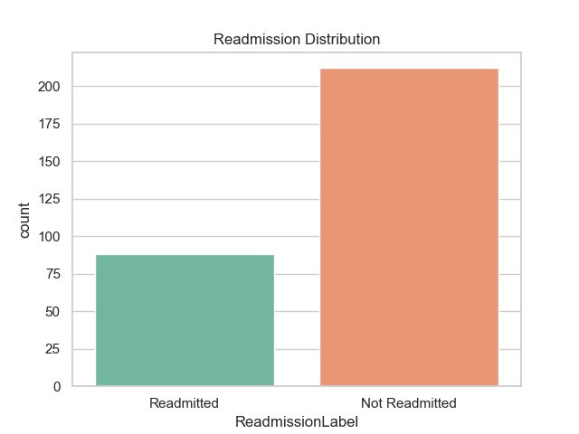
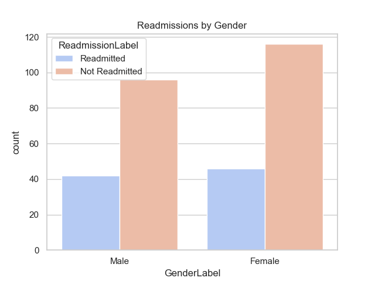
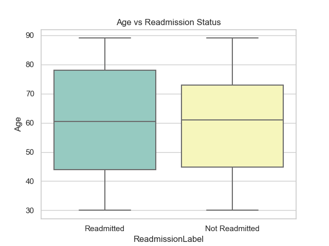
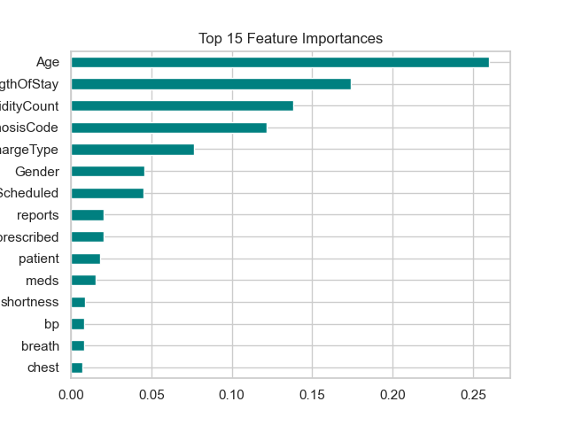
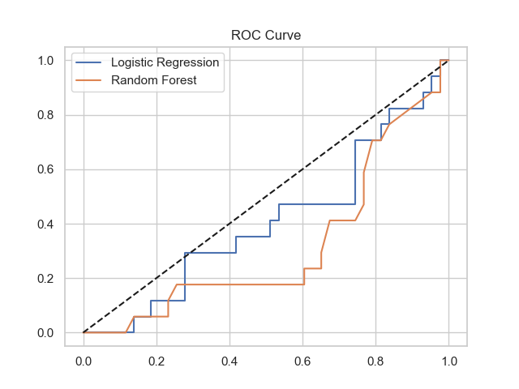

# 🏥 Healthcare Readmission Risk Model

This project predicts the risk of 30-day patient readmissions using clinical data and physician notes.

## 📌 Objective
- Predict unplanned readmission using ML (LogReg + Random Forest)
- Visualize feature importance for clinical interpretability
- Export risk predictions for Power BI dashboards

## 📊 Features Used
- Age, Gender, DiagnosisCode, ComorbidityCount
- Length of Stay, Discharge Type, Follow-Up Scheduled
- TF-IDF from `PhysicianNotes`

## 📈 Sample Visuals

## 📈 Sample Visuals & Key Insights

<table>
  <tr>
    <td></td>
    <td></td>
  </tr>
  <tr>
    <td><b>🔍 Insight:</b> Around 30% of patients were readmitted within 30 days.</td>
    <td><b>🔍 Insight:</b> Slightly higher readmission observed in male patients.</td>
  </tr>
  <tr>
    <td></td>
    <td></td>
  </tr>
  <tr>
    <td><b>🔍 Insight:</b> Older age groups tend to have higher readmission risk.</td>
    <td><b>🔍 Insight:</b> Comorbidity count, length of stay, and physician notes were most predictive.</td>
  </tr>
</table>

  
  
<b>🔍 Insight:</b> AUC of ~0.82 indicates strong model performance distinguishing readmissions.

## 📁 Files Included
- `Healthcare_Readmission_Risk_Model.ipynb` – Complete Jupyter code
- `Healthcare_Readmission_Risk_Model.py` – Python script version
- `*.png` – Visual insights (charts)
- `readmission_model_output.csv` – Output for dashboarding

## 📎 Reference Project Link
**[Reference Project Link](https://github.com/vineethasusan/Healthcare-Readmission-Risk-Model)**
